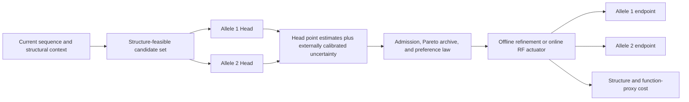

# Dual-Allele Steering: Canonical Scientific Framework

**Status:** Working scientific document; canonical merge of the independent round-1 and round-2
syntheses, updated through RAR 0029.  
**Document type:** Mechanism, evidence, and falsifiable-hypothesis framework; not an implementation
plan.  
**Scope:** Reduce predicted MHC-II immunogenicity for two HLA-DRB1 alleles on one protein sequence
while exposing the structure, function-proxy, and edit cost.  
**Measurement evidence:** [RAR 0027](../Results/Analysis/0027-dual-allele-steering-evidence-cross-alle/record.md),
[RAR 0028](../Results/Analysis/0028-cross-allele-leakage-of-single-allele-co/record.md), and
[RAR 0029](../Results/Analysis/0029-rar-0028-derived-audit-clustered-leakage/record.md).  
**Research evidence:** [Research 0001](../Results/Research/0001-dual-allele-steering/record.md),
[Research 0002](../Results/Research/0002-dual-allele-steering-lit-round2/record.md), and
[Research 0003](../Results/Research/0003-dual-allele-surrogate-uncertainty/record.md).

---

## 1. Scientific objective and deployment semantics

A completed sequence has an allele-specific immune-risk vector, not one intrinsic “double-allele
score”:

$$
\mathbf{R}(x)=\big(R_1(x),R_2(x)\big).
$$

For the NetMHCIIpan endpoint, let $C_a(x)$ be the number of distinct strong 9-mer core loci for allele
$a$. Joint elimination,

$$
\big(C_1(x),C_2(x)\big)=(0,0),
$$

is an aspirational endpoint, not the only valid output. A non-zero design remains scientifically useful
when it lies on a better immune--structure frontier than the available joint-zero designs.

The full design object has at least four components:

$$
\mathbf{Y}(x)=\big(C_1(x),C_2(x),S(x),n_{\mathrm{edits}}(x)\big),
$$

where $S$ is a structure or function-relevant loss vector rather than a hidden penalty. Fixing a
structure budget and optimizing $(C_1,C_2)$ produces one slice of this higher-dimensional frontier; a
single immune preference weight does not by itself trace the structure trade-off.

Two deployment meanings must remain separate:

- **Named-allele protection:** neither selected allele may regress; each allele is a first-class
  constraint.
- **Population objective:** allele contributions may be frequency weighted or summarized through a
  population-coverage model.

An allele-frequency-weighted additive score is not the same mathematical object as genotype-level
population coverage. The current project question is named-allele protection unless an experiment
explicitly declares otherwise.

This is a **multi-objective constrained protein sequence steering** problem, not a multi-instance
learning problem. Peptide windows are already the instances inside each Head; the two alleles define
different objectives over the same sequence.

## 2. Metric contract and current evidence

### 2.1 Strong windows, distinct cores, and Head energies

Three quantities must not be conflated:

1. `n_strong_binders` from `evaluate_phase_c.py` counts strong peptide rows across peptide lengths
   12--25 at `rank_EL < 2.0`.
2. $C_a$ counts distinct strong 9-mer core loci after deduplication by core start.
3. Head `global_risk` and local logits are learned ranking energies; they are neither calibrated
   probabilities nor interchangeable across independently trained allele checkpoints.

RAR 0028 used the first quantity. RAR 0029 reconstructed the second from the retained peptide tables.
All mechanistic conclusions about edit targets and newly created epitopes must use distinct cores, not
the multiplicity of overlapping strong peptide windows.

### 2.2 Evidence ledger

| Observation | Measured result | Scientific boundary |
|---|---:|---|
| Single-allele count-0 coverage, 0701 / 0401 / 1501 | 123/123, 117/120, 119/120 seeds | Two 0701 seeds already had zero target cores; successful target-zero designs are available, but this is not systematic dual reachability. |
| Median true edits to single-allele zero, 0701 / 0401 / 1501 | 6 / 6 / 3 | Conditioned on the current refinement mechanism and structure gate. |
| Median seed-to-refined scTM change | +0.00029 / +0.00361 / +0.00192 | Global self-consistency only; active-site RMSD is absent. |
| WT exact-core Jaccard, 0401--0701 / 0401--1501 / 0701--1501 | 0.133 / 0.067 / 0.000 | Endpoint core sets have low overlap; mutation effects need not be independent. |
| Three-allele WT core union / largest single-allele core set | median 1.8 | The target set expands; this does not imply mutation independence or 1.8-fold more edits. |
| WT strong-count Spearman for the same pairs | -0.262 / +0.348 / -0.069 | Protein-level burden ordering is not shared across alleles. |
| Off-target refined distinct-core median after target-zero refinement | 3--6 | Passive transfer rarely removes the full second-allele burden. |
| Paired off-target core-count delta median | 0 or -1 | Successful target-zero refinement commonly has modest positive transfer. |
| Off-target net core-count regression | 6.5--15.4% per direction | Net count regression is not the only locus-level failure. |
| Any newly strong off-target locus | 14.3--34.1% per direction | New loci can appear even when the net count improves. |
| Both off-target counts non-worsening for one target-zero design | 76.1--82.4% | Measured in selected successful uricase designs, not all proposals. |
| Any new locus in either off-target allele | 31.1--46.3% | Count no-regression does not imply locus stability. |
| Incidental pairwise dual-zero endpoints | 10/359 designs (0401->1501: 2; 0701->0401: 1; 0701->1501: 7); triple-zero = 0 | Five began with positive burden for both alleles and reached zero for both; existential evidence only. |
| Median within-protein static level-wise Head--NMP candidate Spearman | 0.470 / 0.508 / 0.476 | Static within-allele ranking is useful but imperfect. |
| Off-target Head-delta vs core-count-delta Spearman | 0.04--0.21 | Counterfactual safety is much weaker than static ranking. |
| Precision of `Head delta > 0` for detecting core-count regression | 8--20% | Head sign cannot certify NMP no-harm. |
| Existing off-target Head late selection | descriptive protein-median improvement in 4/6 directions, tie in 1, worsening in 1 | Not held-out; candidate-pool opportunity differs by protein/direction. Useful as an exploratory ranker, not a universal selector. |

### 2.3 Inference boundary

The 359 cross-scored designs are target-count-zero survivors. The 0401 and 1501 failures are absent,
and each `best_count0_per_seed` row was chosen within the target-zero set by low edit count and then
structure. The off-target result was not used for that choice, but the cohort remains conditioned on
target success.

Designs are nested within 22--24 uricase proteins. Protein-equal sensitivity analysis does not reverse
the off-target distinct-core delta pattern, but no clustered confidence interval is available and
design rows are not independent biological replicates. The three steered
cohorts share proteins but have zero exact `(protein_id, sequence_original)` overlap. Their directional
differences therefore cannot establish a preferred sequential order.

Current conclusions are restricted to uricases, the 0701/0401/1501 checkpoints, the stored successful
refinement population, and predicted binding endpoints.

## 3. Updated cross-allele mechanism

The most useful synthesis is not “shared” versus “independent” objectives. It is a distinction between
two geometries.

### 3.1 Endpoint geometry

WT distinct-core overlap is low, so the two alleles frequently identify different endpoint loci. A
union of allele-tagged active loci is therefore the default targeting hypothesis; an intersection-only
rule would systematically omit allele-specific cores.

Classic binding-repertoire studies also report broad shared pocket preferences among common HLA-DR
alleles, while later functional classifications distinguish 0401 and 0701 into different supertypes.
This supports a possible shared background motif plus allele-specific peaks, but it does not establish
that a specific mutation will improve both alleles. MHC peptide-pocket positions such as P1/P4/P6/P9
must also be kept terminologically separate from the enzyme's catalytic hard anchors.

### 3.2 Mutation-response geometry

A mutation changes every overlapping peptide register. Consequently, low WT hotspot overlap does not
imply independent mutation responses. The decision-relevant object is the paired perturbation vector

$$
\Delta(c)=\big(\Delta R_1(c),\Delta R_2(c)\big),
$$

together with the resolved and newly created core-start sets for both alleles.

RAR 0029 shows neutral-to-modestly-beneficial transfer at the population level and substantial locus
turnover at the design level. The mechanism is therefore:

> Endpoint peaks often differ, while edit responses remain coupled through overlapping registers.

This evidence supports a sequential warm start as a serious baseline, but not the claims that the two
objectives are mutation-independent, that dual steering simply costs twice as many edits, or that a
single-allele endpoint is automatically safe for the second allele.

### 3.3 Count no-regression versus locus no-regression

Two safety semantics should be reported separately:

$$
C_a(x_{\mathrm{out}})\leq C_a(x_{\mathrm{seed}})
$$

and

$$
N^{\mathrm{new}}_a(x_{\mathrm{out}})=0.
$$

The first permits core turnover when more loci are resolved than created. The second prohibits any new
strong locus and is stricter. The deployment requirement must state which one is binding; reporting
only total core count hides this distinction.

## 4. Two frozen Heads and three fusion surfaces

The preferred near-term architecture retains two allele-specific Heads and composes their outputs
late. A pair-specific scalar Head would hide which allele improved and which regressed.

### 4.1 Allele-specific normalized changes

For candidate $c$ in block $B$, retain one local risk per allele:

$$
R_a^B(c)=\operatorname{LME}_{w\in\Omega_a(B)}z_{a,w}(c).
$$

Because checkpoints have different raw scales, compare changes through a fixed allele-specific scale:

$$
\widehat d_a(c)=\frac{R_a^B(c)-R_a^B(x_{\mathrm{current}})}{s_a}.
$$

The scale $s_a$ should come from held-out, structurally feasible local proposals that match the intended
actuator and trajectory stage. Terminal seed/refined pairs are not automatically a calibration set for
online D2 proposals. A batch-specific scale would make pressure depend on the current candidate pool.

Normalization is not uncertainty calibration. RAR 0029 shows that the sign of a multi-edit Head delta
is a weak detector of NMP core regression. A future calibration must estimate quantities such as

$$
P\!\left(\Delta C_a>0\mid \widehat d_a\leq\epsilon_a\right)
$$

on held-out paired perturbations, preferably split by protein and trajectory state. Calibration must
also measure true NMP Pareto-improver recall and regression risk after top-$k$ or minimum-Head
selection; otherwise larger candidate pools can amplify selection error. Until then, Head dominance
is a proposal/ranking statement, not an endpoint safety certificate. Uncertainty-aware
partial-order and probabilistic-dominance methods provide the relevant conceptual precedent
(Research 0003); they do not force this project to adopt Bayesian optimization.

### 4.2 Keep the fusion surfaces distinct

| Fusion surface | Scientific role | Working position |
|---|---|---|
| **Where** | Identify immunologically actionable loci. | Form a union of allele-specific active windows/cores while retaining allele provenance. Shared-pocket priority remains a hypothesis, not a measured joint win. |
| **Which** | Choose a structurally feasible mutation direction. | Evaluate each candidate under both Heads, retain the vector, and use an explicit admission plus preference law. |
| **How hard** | Allocate global pressure over proteins and trajectory time. | Use worst-residual, named-allele, or declared population semantics; do not reuse an unexamined raw-logit sum. |

Candidate direction and global pressure are different scientific objects. A candidate can be jointly
useful while the protein should receive little global intervention, or vice versa.

## 5. Candidate laws are hypotheses and baselines

No objective law is yet the project winner. An open-loop comparison should first score the same
candidate cloud; because a closed-loop law changes later candidate clouds, the final comparison must
also match total proposal, endpoint-evaluation, search, and structure budgets.

### 5.1 Admission and terminal acceptance

A Head-based admission band can be written

$$
\mathcal{F}_{\mathrm{Head}}
=
\left\{c:\widehat d_1(c)\leq\epsilon_1,\;\widehat d_2(c)\leq\epsilon_2\right\}.
$$

This is a safety filter over surrogate predictions, not the classical epsilon-constraint algorithm and
not a proof of NMP feasibility. Strict per-step dominance may also block multi-edit paths that require
bounded temporary worsening. Beam or archive admission may therefore allow a declared temporary
regression, while terminal outputs obey the stricter count and locus rules.

### 5.2 Linear scalarization

The direct product-of-experts baseline is

$$
\Phi_{\mathrm{lin}}(c)=w_1\widehat d_1(c)+w_2\widehat d_2(c).
$$

It is cheap and maps directly onto additive log rewards. Its failure mode is compensation: a large gain
for one allele can hide a regression in the other. Under global optimization, weighted sums recover
supported Pareto points and may miss unsupported parts of a non-convex or discrete front.

### 5.3 Worst-case and augmented Chebyshev scalarization

A comparator that emphasizes the currently limiting objective is

$$
\Phi_{\mathrm{cheb}}(c)
=
\max_a w_a\big(\widehat d_a(c)-z_a^\star\big)
+
\rho\sum_a w_a\big(\widehat d_a(c)-z_a^\star\big),
$$

with an ideal reference $z^\star$, positive weights, and small augmentation $\rho$. Within one
seed/problem comparison, the reference must remain fixed across objective laws and trajectory steps;
cross-protein use requires an explicitly common normalized scale. Chebyshev
completeness results assume suitable references and global solution of each scalar subproblem. A local
beam or finite candidate ranker only approximates the reachable front; a preference sweep does not
guarantee that its ensemble equals the true front.

### 5.4 Pareto archive

For a finite candidate set, explicit non-dominated sorting is the least committal comparison surface.
An archive over Head point estimates is an uncertainty-aware **exploratory** archive: overlapping or
ambiguous comparisons may remain unresolved. An archive over NMP-scored candidates is the endpoint
Pareto archive. Neither should be labeled the true endpoint front from deterministic Head point
estimates alone. Diversity and structure cost must be retained rather than evaluated only after a
single immune winner is selected.

### 5.5 Objective law is not the sampler

The objective law defines which terminal distribution or candidate preference is desired. The sampler
defines how that target is explored. They are conceptually distinct but coupled through the potential,
proposal, importance correction, and finite search budget.

For example, multiplying two Feynman--Kac reward potentials gives

$$
\exp(-\beta_1R_1)\exp(-\beta_2R_2)
=
\exp\big[-(\beta_1R_1+\beta_2R_2)\big].
$$

The sampler may approximate this tilted distribution more faithfully than a naive trajectory update,
but its objective remains a weighted sum. SMC therefore does not by itself remove compensation or
recover unsupported Pareto points. Feynman--Kac/SMC is retained as a V2 trajectory-sampling direction,
not the current composition law and not the same object as the existing block-candidate actuator.

## 6. Sequential and simultaneous refinement

Sequential refinement is now more than a ceremonial baseline. The observed partial transfer and ten
incidental dual-zero endpoints make a count-zero warm start scientifically plausible. The minimal
reachability question is whether applying the existing second-allele refinement to an existing
first-allele-zero output preserves the first endpoint and reaches a useful joint frontier.

Both directions must be tested. Existing directional cohorts cannot determine the better order because
their initial sequences are unmatched. A causal order comparison requires the same $x_0$, matched
proposal/search budget, matched structure policy, and terminal scoring under both alleles.

Simultaneous refinement remains a distinct hypothesis. It is justified if explicit vector awareness
prevents first-allele relapse, reduces new-locus creation, or improves the immune--structure frontier at
matched edit/search cost. It is not justified merely because it is more symmetric.

The interpretation branches are:

- Sequential continuation usually retains the first zero: sequential refinement becomes the strong
  baseline, followed by a matched same-$x_0$ order study.
- Sequential continuation frequently reintroduces the first allele: protected sequential or
  simultaneous vector-aware admission becomes mechanistically necessary.
- Both approaches exhaust edit/structure authority before reaching a useful joint endpoint: the main
  limit is the reachable union budget, not scalarization choice.

## 7. Structure and function-relevant cost

The project permits a controlled structure sacrifice for immune benefit, but that sacrifice must be a
declared axis. Each output should retain at least

$$
\left(
C_1,
C_2,
\Delta\mathrm{scTM},
\mathrm{active\mbox{-}site\ RMSD},
n_{\mathrm{edits}}
\right).
$$

Hard catalytic residues remain sequence constraints. Global scTM, pLDDT, and backbone RMSD describe
fold self-consistency; they do not certify enzyme function. Prior deimmunization studies show that
activity can vary independently across multi-mutation designs, not that activity must decline
monotonically with edit count. Active-site or catalytic-shell geometry is therefore the minimum local
function proxy before making a stronger local geometry-preservation claim. Enzyme activity still
requires assay evidence.

The current single-allele refined tables preserve catalytic-anchor identities and generally preserve
scTM, but active-site RMSD is absent. The dual immune--structure frontier remains unmeasured.

## 8. Endpoint evaluator roles differ offline and online

The phrase “NMP validator” has two different meanings in this project.

### 8.1 Offline refinement

The current refinement loop calls NetMHCIIpan in every round to construct distinct-core states, admit
improving beam candidates, and define count-zero success. NMP is therefore an **in-the-loop search
oracle and endpoint definition**. Re-evaluating the final sequence with the same NMP configuration
confirms objective attainment but is not independent validation against predictor exploitation.

The Head can reduce NMP evaluation cost by proposing or ranking candidates. Its scientific value should
be measured through Pareto-improver recall and search efficiency, not by relabeling the NMP-optimized
endpoint as independent validation.

### 8.2 Online RF

In online RF, the Heads supply generation-time information and NMP remains outside the trajectory.
Terminal cross-allele NMP evaluation is then an **out-of-trajectory endpoint evaluation** of whether
Head-guided actuation transferred to the declared endpoint. If the same NMP cohort is repeatedly used
to choose laws or hyperparameters, it is no longer an independent holdout; a generalization claim
requires pre-registered proteins/seeds that did not participate in method selection. Targeting quality,
candidate-ranking quality, token delivery, and final persistence must be reported separately.

Biological immunogenicity validation lies beyond both predictor roles and would require experimental
binding, presentation, or T-cell evidence.

## 9. Alternatives and V2 directions

### 9.1 Pair-specific scalar Head

A scalar Head trained for one allele pair is not the preferred next step. It requires a joint label or
training scalarization, loses per-allele attribution, and cannot distinguish mutual improvement from
compensation. Current data already show value and failure modes that are allele-direction specific.

### 9.2 Shared-encoder allele-conditioned Head

A future shared encoder with allele-conditioned vector outputs may reduce inference cost, improve
cross-allele representation sharing, and scale to larger panels. It remains a vector predictor and does
not replace the multi-objective decision layer. MGDA, PCGrad, and CAGrad are relevant only if shared
parameters are trained; they do not define inference-time fusion of frozen checkpoints.

### 9.3 Online durability

Durability gates online RF, not offline refinement. The near-term scientific question is whether the
existing actuator can selectively retain or revisit useful corrections through terminal decoding.
In the archived A-open operating point, 260/405 paired disagreements showed realized local benefit
(`benefit_per_disagree = 0.6420`), whereas only 35/405 satisfied the strict never-remasked persistence
definition (`persist_ever_per_disagree = 0.0864`; [RAR 0005](../Results/Analysis/0005-stage-a-a-open-expanded-candidate-feasib/record.md)).
These are different denominators/semantics and do not show that 64% were “washed out”; they establish
a measured gap between local benefit and strict persistence.
Alternative corruption families, pretrained-model remasking schemes, and true particle SMC are V2
directions. They should not be presented as runtime-equivalent fixes or as prerequisites for the
offline joint-reachability pilot.

### 9.4 Feynman--Kac / SMC

FK/SMC remains a potentially valuable V2 sampler when particle diversity, path degeneracy, and reward
evaluation cost become limiting. It must be tested against the current beam/resampling mechanism under
the same objective law. Its role is sampling a declared scalar potential or ensemble of preferences,
not choosing the multi-objective semantics.

## 10. Working hypothesis hierarchy

| ID | Working hypothesis | Evidence that would support it | Evidence that would weaken it | Current state |
|---|---|---|---|---|
| H1 — joint sequence feasibility | Some seeds admit simultaneous reduction of both allele core burdens under controlled structure cost. | Matched dual refinement reaches joint zero or a stable non-dominated near-zero frontier. | Repeated search finds only mutually exclusive immune gains or unacceptable structure/function-proxy cost. | **Weak existential support:** 10/359 pairwise dual-zero outputs across all three pairs; both burdens fell from positive to zero in 5; triple-zero = 0. Systematic reachability is unmeasured. |
| H2 — off-allele compatibility | Single-allele edits are often net-compatible with the second allele. | High protein-equal non-regression and limited new-locus creation reproduce in matched cohorts. | Target improvement frequently raises off-target counts or creates high-margin new loci. | **Partially supported in selected survivors:** median delta 0/-1, but new-locus turnover remains 14--34% per direction. |
| H3 — vector Head ranking | Two normalized frozen Heads enrich true NMP Pareto-improving candidates without a joint Head. | Held-out local-proposal recall and endpoint-regression calibration remain stable across proteins and trajectory stages. | One Head dominates by scale, true joint improvers are pruned, or calibration is protein/stage specific. | **Mixed:** static level-wise association is moderate; off-target delta safety is weak and late selection is pair dependent. |
| H4 — simultaneous advantage | Vector-aware simultaneous refinement improves on both sequential orders at matched budget. | Better Pareto coverage, first-allele retention, or fewer new loci at matched edits/structure/search cost. | Matched sequential orders reproduce the same frontier with lower complexity. | **Unmeasured.** |
| H5 — controlled structural exchange | Relaxing structure budget buys joint immune improvement smoothly. | Nested structure budgets extend the immune frontier while active-site geometry changes gradually. | Immune gains appear only after abrupt fold or catalytic-shell failure. | **Unmeasured for dual steering; active-site geometry missing.** |
| H6 — online transfer | A law validated offline can guide online RF once token actuation is durable. | Corrections survive decoding and improve terminal dual NMP beyond matched no-dual/single-allele controls. | Useful offline candidates exist but online tokens do not persist or add terminal information. | **Not tested; gated by online durability.** |

## 11. Evidence layers and next scientific gate

### Layer A — Retrospective cross-scoring: complete with boundaries

RAR 0028/0029 measured target-zero designs and paired seeds under all three alleles, reconstructed
distinct-core turnover, added protein-equal sensitivity, and tested frozen-Head late selection. This
layer supports a plausible warm start but does not estimate order causally or calibrate online local
proposal uncertainty.

### Layer B — Offline joint-reachability pilot: next

Continue existing first-allele-zero sequences through the unchanged second-allele refinement in both
directions, then measure joint zero, first-allele retention, new/resolved loci, edits, scTM, and
active-site geometry. This is a feasibility study, not a fair order comparison.

### Layer C — Matched objective-law comparison

From common $x_0$ seeds, compare both sequential orders and simultaneous candidate laws on matched
candidate/search/structure budgets. Retain weighted sum, Head admission, augmented Chebyshev, and
explicit Pareto archive as comparators. The primary result is the reachable frontier, not the number of
easy seeds reaching zero.

### Layer D — Online RF transfer

Only after a useful joint candidate law exists and online actuation is durable should the law be mapped
onto targeting, candidate direction, and global pressure. This prevents a persistence failure from
being misread as dual-allele biological conflict.

### Layer E — Head consolidation or V2 sampling

Revisit shared-encoder Heads, FK/SMC, or alternative remasking only if inference cost, calibration,
particle/path search, or scaling to larger allele panels becomes the limiting factor.

## 12. Reporting and inference discipline

Every dual experiment should report, per sequence and allele:

- distinct strong-core count;
- strong peptide-window count;
- rank/margin distribution;
- resolved, retained, and newly strong core loci;
- Head risk and Head-to-endpoint agreement.

Joint reporting should include worst-allele burden, per-allele tagged burden, physical-locus union,
count no-regression, locus no-regression, joint-zero rate, non-dominated coverage, and hypervolume only
when its reference point is declared.

Structure reporting should include scTM, pLDDT, global RMSD, active-site/catalytic-shell RMSD,
hard-anchor identity, edit count, and the structure reference. Predicted-backbone self-consistency must
not be described as experimental structural truth.

Statistical reporting should respect protein clustering, distinguish exploratory design-level fractions
from protein-equal summaries, and use matched starting sequences for causal order claims. Head
checkpoint digests, resolved configs, allele identity, NMP version/threshold, and candidate-selection
provenance must be pinned.

Mechanism reporting should separate endpoint geometry, mutation-response geometry, candidate ranking,
search delivery, and final persistence. Head-only improvement is not an endpoint claim.

New measurements should first enter a machine-readable RAR. New literature searches should enter
`Results/Research/`. This document should update hypothesis states and scientific interpretation;
commands, modules, schemas, and parameter sweeps belong in a future `PLAN*.md`.

## Selected references

1. Luo J, Ding K, Luo Y. Pareto-optimal sampling for multi-objective protein sequence design.
   *iScience*. 2025. https://doi.org/10.1016/j.isci.2025.112119
2. Hong L, Kortemme T. An integrative approach to protein sequence design through multiobjective
   optimization. *PLoS Computational Biology*. 2024. https://doi.org/10.1371/journal.pcbi.1011953
3. Schubert B, et al. Population-specific design of de-immunized protein biotherapeutics.
   *PLoS Computational Biology*. 2018. https://doi.org/10.1371/journal.pcbi.1005983
4. Salvat R, et al. Mapping the Pareto optimal design space for a functionally deimmunized
   biotherapeutic candidate. *PLoS Computational Biology*. 2015.
   https://doi.org/10.1371/journal.pcbi.1003988
5. Lin X, et al. Smooth Tchebycheff scalarization for multi-objective optimization. *ICML*. 2024.
   https://proceedings.mlr.press/v235/lin24y.html
6. Southwood S, et al. Several common HLA-DR types share largely overlapping peptide binding
   repertoires. *Journal of Immunology*. 1998. https://pubmed.ncbi.nlm.nih.gov/9531296/
7. Greenbaum J, et al. Functional classification of class II HLA reveals seven supertypes and
   repertoire sharing. *Immunogenetics*. 2011. https://doi.org/10.1007/s00251-011-0513-0
8. Volz V, Rudolph G, Naujoks B. Surrogate-Assisted Partial Order-Based Evolutionary Optimisation.
   2017. https://doi.org/10.1007/978-3-319-54157-0_43
9. Macasieb RQ, et al. A probabilistic approach to surrogate-assisted multi-objective optimization.
   *Water Resources Research*. 2025. https://doi.org/10.1029/2024WR038554
10. Singhal R, et al. A general framework for inference-time scaling and steering of diffusion models.
    *ICML*. 2025. https://proceedings.mlr.press/v267/singhal25b.html

The full source manifests and evidence extracts are preserved in Research 0001--0003.
