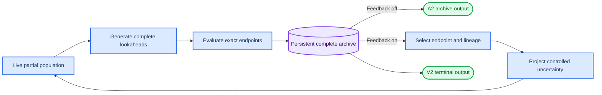

# RF-Refine Fusion v2: Trajectory-Coupled Pre-Terminal Exact-Endpoint Feedback

_Scientific architecture contract. V2 is the main development route; A2 is its feedback-disabled boundary, not a separate prerequisite program._

---

## 0. Status and decisions

This document replaces the earlier high-level V2 sketch with a concrete scientific architecture.
It defines the states, operators, causal controls, evaluation philosophy, and claim boundary. It
does not freeze recursion depth, reopening thresholds, or production configuration values. The
implementation PLAN defines typed interfaces and falsification gates without inventing those
numbers; scientific values in Section 10 remain unresolved until mechanism evidence exists.

The following decisions are frozen at the architecture level:

1. **V1-A1 is closed as the main route.** Averaging continuation values, discarding the scored
   endpoints, and drawing a fresh completion propagates the wrong object.
2. **A2 is retained as the feedback-disabled scientific boundary.** Partial-prefix sharing and
   exact complete-endpoint evaluation already exist, but prospective endpoint carry-forward has
   not been executed. A2 therefore does not require a separate scientific campaign before V2;
   its production path must be implemented and validated inside the shared V2 runner.
3. **V2 is the main method.** It writes a selected exact complete endpoint back into an unfinished
   inverse-folding trajectory through controlled projection or re-noising, then continues base
   diffusion.
4. **A2 remains inside every V2 experiment as the feedback-disabled view.** It uses the same
   partial roots, complete lookaheads, Head records, and archive up to the feedback transition.
5. **Recursion is part of the architecture, but its depth is open.** A one-feedback run is the
   smallest executable V2 instance, not the definition of the method.
6. **No single fixed compute budget defines success.** The primary scientific object is a
   capability frontier across a predeclared compute ladder. Compute remains fully measured and is
   used for secondary matched-compute attribution.
7. **The long v0 complete-state local-feedback package is not a mandatory suffix of the V2
   primary endpoint.** It is a source-forgetting boundary comparator or an optional secondary
   cleanup whose before/after effects must be reported separately.
8. **The first V2 substrate has no background global remask.** V2 and A2 use the same
   controller-free, h-map-free, `constant_one` base sampler with effective
   `remask.fraction_scale=0.0`. Resolved editable positions can become masked again only through
   the explicit V2 feedback-support policy. This is a causal-identifiability choice, not a claim
   that remask is generally harmful to DPLM.
9. **Progressive recurrence is primary; stationary recurrence is one compact comparator.** Both
   use one projected-segment operator. The primary schedule satisfies $c_{d+1}>c_d$; a small
   stationary diagnostic may set $c_{d+1}=c_d$ to test whether temporal progression matters.
   There is no substrate tournament and no second stationary implementation stack.

### 0.1 Executed V1-A1 result

The executed, pre-registered P1 development result comes first. It did not support the operational
V1-A1 route:

| Executed endpoint | Pre-terminal minus Terminal | Evidence boundary |
| --- | ---: | --- |
| Pre-Fusion feasible round-0 parent | median `+0.127`; sign-flip `p=0.997`; `16/24` common-feasible | Pre-terminal was worse at the entry layer |
| Post-v0 elite | median `+0.0084`; sign-flip `p=0.897`; bootstrap interval `[-0.0032,+0.0237]`; `16/24` common-feasible | neither pre-registered positive reading passed |

The persisted verdict was `DEV_DIAGNOSTIC`, not GO/KILL: the 24-protein development cohort did not
meet the frozen holdout coverage or repeat gates. These observations close V1-A1 as the main route;
they do not constitute a held-out test of A2 or V2, neither of which was executed.

### 0.2 Post-hoc mechanism diagnostics

The following measurements explain why V1-A1 was wasteful and motivate retaining exact endpoint
breadth as an untested primitive. They are not evidence of system superiority:

| Development diagnostic | Observation | Interpretation |
| --- | ---: | --- |
| Root `K_EST` mean versus a fresh completion | median per-protein Spearman approximately `0.049` | root-value ordering did not predict a redraw reliably |
| Best estimator endpoint versus one later fresh completion | pooled `82.64%`, close to the exchangeable best-of-4 expectation `80%`; mean endpoint versus fresh completion reverses to `39.9%` | proves that discarding already paid, exactly scored endpoints is wasteful; does not prove partial-root allocation |
| Post-hoc carry-forward best-1 versus Terminal raw entry pool | median delta `-0.030`; Pre-terminal won `19/24` proteins | entry-layer counterfactual only; no prospective carry-forward, structure admission, or v0 package |
| Post-hoc carry-forward top-4 versus Terminal raw entry pool | median delta `-0.072`; Pre-terminal won `21/24` proteins | supports testing endpoint preservation prospectively, not a system-level reversal |
| Within-root redraw noise versus between-root estimator signal | `2.258` versus `1.064` SD | redraw noise dominated the quantity used for root ranking |
| Exact complete endpoints at similar entry DFE | `64` estimator endpoints versus `19` Terminal endpoints per protein; total Pre-terminal Head calls were `76` versus `19` | prefix sharing created DFE-amortized endpoint breadth, while exact-Head work was not matched |

Rows comparing carry-forward endpoints directly against the Terminal post-v0 elite are deliberately
not used as a matched conclusion: only the Terminal side received the full v0 package in that
comparison. The correct conclusion is narrower: **V1-A1 failed. Prefix-amortized endpoint breadth
remains a plausible but prospectively untested resource.** The counterfactual is sufficient to
retain A2 as V2's feedback-disabled control, not to claim A2 or V2 efficacy.

### 0.3 Measured substrate risk

Under the frozen V1 `c1_null` substrate, realized maturity was highly compressed in sampler time:
the median crossings for `rho=0.30/0.50/0.70` occurred at steps `90/95/98` of 100. At `rho=0.50`,
about `101.5` editable positions remained unresolved and five full-sequence denoiser updates
remained. Same-root complete siblings differed by about `63.8` residues on average, with a
within-root/between-root Hamming ratio of `0.7335`.

These measurements establish a **late-clock transmission risk**, not the absence of an
intervenable state. They measure natural variation under fixed conditioning and cannot determine
whether a selected-endpoint perturbation propagates into descendants. V2 must therefore treat
feedback transmission as its first causal gate. It also keeps the late lookahead coordinate
separate from the earlier feedback re-entry coordinate so cheap screening and useful plasticity
are not forced to use the same time point.

The late clock is specific to the remask-on V1 substrate. In the matched remask ablation, turning
background remask off produced the largest visible change in sequence recovery
(`0.5546 -> 0.4993`), which is not a V2 objective. ESMFold self-consistency was also measured: the
matched mean/median $\Delta\mathrm{scTM}$ was only `-0.0095/-0.0048`, and the fraction below `0.5`
changed from `17.5%` to `18.0%`. This is not definitive evidence for recursive V2 or anchored
local structure, but it gives no basis for treating background remask as a required structural
protector. The first V2 substrate therefore removes it and verifies only a small terminal/anchor/
refold sanity before scientific recurrence.

## 1. Scientific lineage

The four relevant systems differ in the state that receives future generative budget.

| System | Reward-facing evidence | Inherited state | Role in V2 program |
| --- | --- | --- | --- |
| v0 Fusion | exact Head and structure evidence in an iterative complete-state loop | selected complete sequence; a fresh local register/halo reopen state is rebuilt each round and the original partial trajectory is forgotten | source-forgetting complete-state local-feedback boundary |
| V1-A1 | mean Head value over complete continuations | original partial root, followed by a fresh redraw | closed negative mechanism |
| A2 | exact Head values of prefix-amortized complete endpoints | selected exact complete endpoint retained in the archive | prospective archive-only boundary; V2 with feedback disabled |
| V2 | exact Head values of prefix-amortized complete endpoints | a new live partial state derived from the selected endpoint and its source partial state | main recursive architecture |

This gives one exact limiting case:

$$
\mathrm{A2}
=
\mathrm{V2}\;\big|\;\text{feedback disabled}.
$$

The complete-state v0 transition can be written schematically as

$$
q_{\mathrm{v0}}
\left(P'\mid y,S,C,B_H(y)\right),
$$

where the reopened state is reconstructed from a complete endpoint and local Head-responsible
support. By contrast, the defining V2 transition is

$$
q_{\mathrm{V2}}
\left(P'\mid y,P,S,C,\pi\right),
$$

and must materially depend on the compatible source partial state $P$. V2 therefore generalizes
the evaluated reopen-denoise-select outer loop already present in v0; recursion itself is not the
new claim. If source state is discarded and only the reopen width changes, the implementation is
wide-halo v0 rather than V2.

V1-A1 is not a limiting case worth preserving as a primary arm because it discards the exact
endpoint and substitutes a noisy scalar estimate plus redraw.

## 2. Architecture overview

V2 maintains two coupled but non-interchangeable state layers:

- a **complete endpoint archive** containing exact scored sequences that are never destroyed by
  re-noising; and
- an **active partial population** whose members continue through the base backbone-conditioned
  inverse-folding diffusion.



The loop is:

1. freeze a live partial state at maturity $\rho_d<1$;
2. reuse that prefix to generate multiple complete endpoints;
3. evaluate every endpoint as an exact canonical sequence;
4. update the never-destroyed complete archive;
5. select one or more endpoint lineages for feedback;
6. project controlled uncertainty into copies of those endpoints, using information from both the
   endpoint and the source partial state;
7. resume the base inverse-folding diffusion; and
8. repeat until a stopping rule terminates the active population.

The complete sequence is therefore neither merely ephemeral nor permanently terminal. It is a
durable archive state and, when selected, a source for the next partial generative state.

## 3. State contract

Let $d=0,1,\ldots,D$ index feedback depth. V2 keeps two time coordinates separate:

- $c_d$ is the base-diffusion checkpoint at which the live state is frozen and complete
  lookaheads are observed;
- $r_d$ is the earlier re-entry coordinate assigned to the feedback-projected state; and
- $\rho_d\in[0,1]$ is the **realized editable maturity** of the state, where $\rho_d=1$ is
  complete.

Diffusion coordinate and realized maturity are related by the frozen schedule only in
distribution; they are not interchangeable. Two trajectories at the same $c_d$ may contain
different numbers of resolved editable tokens, and one categorical update may resolve many
positions at once. In the frozen no-remask V2 substrate, unresolved mass is monotone within a
propagation segment and can increase only at an explicit feedback projection. Every state and
transition must nevertheless record both sampler coordinate and realized maturity.

One feedback cycle always obeys

$$
r_d < c_d,
\qquad
c_{d+1}\geq c_d.
$$

The lookahead branches run from $c_d$ to completion without advancing the committed live state.
After endpoint selection, feedback temporarily returns the committed state to $r_d$ and the base
denoiser propagates it forward to the next committed checkpoint $c_{d+1}$. Two coordinate laws use
the same segment operator:

- **stationary-checkpoint recurrence:** $c_{d+1}=c_d$; feedback depth advances while the
  lookahead horizon remains fixed; and
- **progressive-checkpoint recurrence:** $c_{d+1}>c_d$; feedback depth and the sampler checkpoint
  both advance.

Depth is therefore a transition coordinate, not an alias for sampler time. Every history field is
indexed by `(depth, step)` so repeated use of one sampler step cannot collapse distinct ancestry
events. The first V2 program freezes progressive recurrence as the main law. Stationary recurrence
is one small, predeclared comparator using the same substrate, support policy, and segment
executor; a run may not switch laws adaptively after observing reward.

The measured remask-on `c1_null` clock cannot be used to choose this schedule: its useful maturity
crossings were compressed near the end of a 100-step trajectory by repeated global remasking. The
frozen no-remask substrate must instead be scanned at explicit sampler steps. That scan calibrates
the tuples $(r_d,c_d,c_{d+1})$ and empirical maturity bands; it is geometry calibration, not a
third experimental arm or a substrate qualification tournament.

For a sampler with $S$ total denoiser steps and $K$ complete lookaheads from a checkpoint $c$, the
logical screening cost for one lineage is

$$
C_{\mathrm{screen}}(c,K)
=
c+K(S-c).
$$

If $L$ selected lineages are projected to an earlier re-entry coordinate $r$, the added propagation
cost before their next observation is bounded separately as

$$
C_{\mathrm{feedback}}(r,L)
=
L(S-r)
$$

for full re-completion, or by the corresponding shorter segment when the next observation occurs
before $S$. A late $c$ can therefore retain cheap endpoint screening while a smaller number of
selected lineages pay for an earlier $r$. Plasticity and prefix amortization form a breadth-depth
tradeoff; they are not forced to use one shared maturity coordinate.

### 3.1 Live partial state

A live partial state $P_d$ contains at least:

$$
P_d
=
\left(
x_{\rho_d},
S,
C,
E_d,
\bar y_d,
c_d,
\rho_d,
\xi_d,
\ell_d
\right),
$$

where:

- $x_{\rho_d}$ is the current masked or partially resolved token state;
- $S$ is the fixed backbone conditioning context;
- $C$ is the immutable constraint set, including hard anchors;
- $E_d$ is the currently editable position set and its resolution history;
- $\bar y_d$ is the immutable depth-0 complete safety reference carried by the lineage for
  cumulative whole-landscape new-hotspot checks;
- $c_d$ is the sampler coordinate at which this live state was captured;
- $\xi_d$ is exact replay state, including the relevant random stream; and
- $\ell_d$ is explicit lineage identity.

A partial state is not scored directly by the whole-sequence Head. Its scientific value is
represented only by the exact complete futures generated from it.

Every position also carries explicit active-origin and provenance state. The recursive contract
must not compress these into one lossy label:

```text
active_origin_kind in {
    unresolved,
    hard_anchor,
    denoiser_sample,
    feedback_injection
}
feedback_origin_ref in {
    none,
    source_state,
    selected_endpoint
}
```

Together with `active_commit_depth_step`, `origin_transition_id`, and immutable provenance evidence,
these fields distinguish a naturally sampled source token from source-feedback or
endpoint-feedback injection without erasing older ancestry at the next recursive depth. Token
equality is never sufficient to reconstruct origin.

The **provenance evidence** records where an identity came from and is immutable. The **active
sampler state** records the score and history that the current re-entry trajectory is legally
allowed to consume. Endpoint or later-source evidence can never silently become an active sampler
score at an earlier coordinate.

### 3.2 Complete endpoint

From $P_d$, the base inverse-folding model defines a completion kernel

$$
y_d^{(k)}
\sim
p_\theta\left(\cdot\mid P_d\right),
\qquad
k=1,\ldots,K_d,
$$

where every $y_d^{(k)}$ is a complete canonical AA20 sequence. A complete endpoint record binds:

- the exact sequence and digest;
- the source partial-state and root identity;
- completion seed and replay identity;
- immutable per-position completion provenance bound to the terminal context and coordinate;
- complete-state Head score and responsible-window evidence;
- structural-feasibility status and evidence level;
- realized compute; and
- descendant lineage, if feedback is later applied.

The endpoint, reward, seed, and lineage are one scientific object. None may be reconstructed later
from sequence similarity, row order, or score coincidence.

### 3.3 Complete archive

Let $\mathcal{Y}_d$ be the endpoints evaluated at depth $d$. The archive update is monotone:

$$
\mathcal{A}_{d+1}
=
\operatorname{Archive}
\left(
\mathcal{A}_d\cup\mathcal{Y}_d
\right),
$$

with

$$
\mathcal{A}_d\subseteq\mathcal{A}_{d+1}
$$

at the level of exact endpoint identity. The archive may maintain an ordered elite, a diverse
frontier, or both, but re-noising never deletes a previously discovered endpoint.

Archive entries carry an explicit feasibility state such as `unvalidated`, `provisional`, or
`definitive`. Only definitively feasible endpoints support final immune-structure claims.

### 3.4 Feedback event

A feedback event is a replayable transition record:

$$
G_d
=
\left(
P_d,
y_d^*,
\pi_d,
\widetilde P_{d+1},
P_{d+1},
\ell_{d+1}
\right),
$$

where $y_d^*$ is an exact selected endpoint and $\pi_d$ is the frozen feedback policy used for
that event. $\widetilde P_{d+1}$ is the immediate reopened state at $r_d$, while $P_{d+1}$ is the
committed live descendant after propagation to $c_{d+1}$. The record must expose both coordinates
and realized maturities, which identities were protected, which positions were reopened, and why
the new partial state is scientifically attributable to the selected endpoint.

## 4. Recursive operators

### 4.1 Prefix-amortized lookahead

The first operator is the A2 primitive: one unfinished prefix generates multiple exact complete
futures. The endpoint pool is useful in its own right; it is not merely a Monte Carlo device for
estimating a scalar root value.

The number of futures $K_d$ may vary along a declared scaling ladder. V2 does not require a fixed
`K_EST`-style mean, and it does not discard exact endpoints after aggregating them.

### 4.2 Complete-state evaluation

The frozen Head evaluates complete AA20 endpoints only:

$$
R_H\left(y_d^{(k)}\right)\in\mathbb{R}.
$$

Structural evaluation may be staged because definitive refolding is expensive. A cheap proposal
prior or backbone-conditioned likelihood can prioritize evaluations, but it is not a definitive
feasibility verdict. Any endpoint promoted into feedback ancestry or used for the final capability
frontier must pass the frozen definitive structure contract. A future provisional-parent policy
would be a distinct scientific method and is not authorized by this architecture.

Here, `exact Head` means that the frozen Head is evaluated on and bound to the exact complete
sequence. It does not mean that the Head is a ground-truth immune assay.

NMP or another independent immune evaluator remains outside the loop. It is used for robustness
assessment, never for runtime selection, feedback-mask construction, or stopping.

### 4.3 Archive update and endpoint selection

Selection acts on exact `(source partial state, endpoint)` lineage pairs, not partial-state scalar
estimates or detached archive sequences. Define the joint admissibility contract

$$
I_{\mathrm{adm}}(y\mid P)
=
\mathbf{1}
\left[
F_S(y)=1,\;
C(y)=1,\;
N_H(y;\bar y_P)\leq\delta_{\mathrm{new}}
\right],
$$

where $F_S$ is definitive structural feasibility, $C(y)$ means all immutable constraints are
preserved, and $N_H$ is a V2-specific frozen whole-landscape new-hotspot check. It operates on two
identity-bound complete `HeadScore` objects with identical protein, sequence length, Head identity,
and window-coordinate grid:

$$
N_H^{\mathrm{whole}}(y;\bar y_P)
=
\max_w\left[z_w(y)-z_w(\bar y_P)\right]_+.
$$

Positive mass and count are retained as telemetry. This is not the v0 immediate-parent,
off-halo gate; only the strict finite/window-alignment primitive is reusable. The depth-0 safety
reference sequence and its exact Head evidence are content-bound before any depth-0 endpoint is
scored. That immutable reference remains the cumulative safety reference for the lineage so small
per-depth increases cannot ratchet into a large whole-run hotspot. The selected endpoint may also
serve as the immediate-parent reference for step-local telemetry or an independently frozen
incremental gate, but it may not replace the cumulative reference. Using the selected endpoint as
its own depth-0 reference is prohibited because $N_H(y;y)=0$ is self-referential and vacuous.

The threshold $\delta_{\mathrm{new}}$ belongs to a content-bound V2 calibration artifact. The v0
value is at most a sensitivity candidate because the reference and window domain differ; it is not
inherited silently.

A simple selector is then

$$
\left(P_d^*,y_d^*\right)
=
\underset{(P,y)\in\mathcal{L}_{d+1}:\,I_{\mathrm{adm}}(y\mid P)=1}{\arg\min}
\;R_H(y),
$$

where $\mathcal{L}_{d+1}$ is the set of exact stored lineage pairs. The architecture also permits
a frozen diversity-aware or multi-objective selection law. Whatever law is used must be total,
replayable, and independent of input row order.

Projection normally uses the endpoint's own source partial state $P_d^*$. Reusing an older archive
endpoint is allowed only by restoring its stored compatible source/replay lineage; pairing it with
an arbitrary current partial root is forbidden.

Multiple siblings from one partial root may supply breadth, but they cannot purchase ancestry mass
merely through multiplicity. Family-balanced selection or an explicit descendant quota is required
whenever population weights are used.

### 4.4 Controlled feedback projection

The defining V2 operator first creates an immediate reopened state:

$$
\widetilde P_{d+1}
\sim
q_\phi
\left(
\cdot
\mid
y_d^*,
P_d^*,
S,
C,
\pi_d,
r_d
\right).
$$

This operator must materially use both $y_d^*$ and $P_d^*$:

- $y_d^*$ supplies the selected exact identities and complete-state reward evidence;
- $P_d^*$ supplies maturity, unresolved history, source-root identity, editable context, and the
  live diffusion state into which feedback is written;
- $S$ preserves the fixed-backbone inverse-folding problem;
- $C$ makes hard anchors immutable;
- $\pi_d$ defines the protected and reopened sets for that transition; and
- $r_d$ defines the sampler coordinate and remaining propagation horizon of the projected state.

If $q_\phi$ depends only on $y_d^*$ and then invokes the old complete-seed repair loop, the method
is an earlier invocation of v0, not V2.

Rollback is a causal intervention, not a relabeling of a later checkpoint. States are captured at
the top of sampler step $r_d$ before its denoiser forward. A resolved source identity is therefore
temporally natural at re-entry only when $0\leq s_i^{\mathrm{active}}<r_d$. Such a source position
may retain its active sampling history. A source identity committed at step $\geq r_d$ is future
information at that boundary: the support policy must explicitly
choose `inject_from_source_feedback` or `reopen`. It may not request ordinary source carry. A
source-feedback injection resets active history at the intervention boundary while preserving the
original later-source evidence only as immutable provenance. Hard anchors remain a separate
permanent class.

The same separation applies to scores. A token score recorded on a complete endpoint is
`endpoint_provenance_evidence`; it is not the `active_sampler_score` of the projected state at
$r_d$. Endpoint- and source-feedback injections begin as `pending_assimilation`, are protected
through the first ordinary propagation forward and use that
forward's raw base logits and frozen sampler temperature to score their current token identities in
the active re-entry context. They then become `assimilated`; the ordinary forward is reused and no
extra lane-DFE is invented.

The first V2 substrate performs no background global remask, so assimilation and protection are
not additional experiment arms and do not decide whether an injected token survives the current
segment. They remain a state-integrity contract: endpoint evidence may never masquerade as an
active-context score, and recursively inherited state must have truthful score/history semantics
if a later support policy consumes them. The initial
`source_writeback`/`explicit_probe` contract protects both endpoint and source-feedback injections
through the current propagation segment, with exclusive expiry at $c_{d+1}$. This expiry is frozen
for the first V2 program rather than exposed as another optimization axis; changing it is a later
contract revision. Endpoint and source injection may not differ accidentally. Natural source
carries are not protected merely because they were resolved, and hard anchors remain permanent.

Active-context scores are computed by a sampler-neutral primitive,
`log_softmax(raw_base_logits / temperature)[current_token]`, over canonical AA20 identities. The
D3 chosen-token helper is not reused as an implicit dependency because it has
controller-specific semantics and no general temperature contract. Sampling and assimilation
must share the same low-level log-probability calculation.

The active-score status is one of `masked`, `historical_natural`, `pending_assimilation`, or
`assimilated`; anchors are `not_ranked_anchor`. Endpoint provenance is never copied into the active
score slot.

This dependence has two distinct evidence levels:

- **construction:** holding $P_d^*$ and support fixed while changing $y_d^*$ must change the
  immediate projected state, and holding $y_d^*$ and support fixed while changing or ablating its
  compatible source $P_d^*$ must change the immediate projected state; and
- **scientific transmission:** under matched descendant fork seeds, those interventions must
  produce a predeclared, adequately powered change in the descendant sequence distribution.

A matched descendant seed is derived from a pairing identity frozen before either intervention is
materialized: campaign/split, protein, pair ID, depth, shared re-entry/propagation coordinates, and
fork index. It excludes treatment/control labels, endpoint/source/state digests, projected bytes,
and arm-specific policy or transition identities. Otherwise changing the tested source or endpoint
would also change the downstream randomness and invalidate the paired comparison. Realized seeds
and pair membership are persisted and collision-checked.

The immediate byte changes are required by the projection contract and are therefore wiring
checks, not evidence that feedback survives the remaining diffusion process. If endpoint bytes do
not change, the implementation is endpoint-insensitive. If source bytes do not change, it has
discarded the live source trajectory. If both immediate checks pass but the powered
descendant-distribution test is null, source-coupled feedback transmission has not been
established. A Head shift may be reported as a secondary directional effect, but it cannot replace
the sequence-space mechanism test because the Head can compress large sequence variation.

For each transition, let $K_d^{\mathrm{keep}}$ and $K_d^{\mathrm{open}}$ be protected and reopened
position sets. They must obey

$$
C\cap K_d^{\mathrm{open}}=\varnothing.
$$

The policy should be able to preserve trusted endpoint identities while reopening positions that
are reward-responsible, uncertain, internally inconsistent, or implicated by the source partial
trajectory. The exact uncertainty statistic, threshold, reopened fraction, and schedule are open
scientific choices. This document deliberately does not invent their values.

Head evidence is a measurement consumed by $q_\phi$, not a native conditioning channel of the
frozen base denoiser. In the first V2 claim, the Head selects exact endpoints and supplies frozen
whole-sequence/window evidence; $q_\phi$ expresses that evidence through the projected token
state, protected/reopened sets, and re-entry coordinate. Passing a Head scalar or embedding
directly into model logits would require a separately trained conditional model and is outside
this contract.

#### 4.4.1 Kernel-policy delivery boundary

The projection kernel and the production feedback-support policy are separate deliverables. The
kernel applies a typed, total support assignment and enforces state legality. It does not decide
which immune or trajectory evidence should produce that assignment. `explicit_probe` or manually
declared supports are sufficient for deterministic kernel tests and the first transmission
diagnostic, but they do not define a scientifically runnable immune-directed $q_\phi$.

After real one-cycle transmission is established and before recursive capability work, one
`FeedbackSupportPolicySpec` must freeze:

- how residual complete-Head burden is mapped from windows to residues;
- which improvement-associated endpoint identities are protected and relative to which frozen
  reference, without calling them causal unless a positional intervention supports that claim;
- how source instability and active-history evidence enter the support law;
- whether endpoint-sibling consensus or disagreement is used;
- a deterministic total priority for reopening, endpoint adoption, source injection/carry, and
  protection;
- target and realized reopen counts, maturity-band compatibility, and null/fallback behavior;
- per-position reason evidence plus policy version, config, and content digest; and
- an endpoint-only, source-off matched policy with the same support cardinality, re-entry horizon,
  fork seeds, and resource envelope.

Two source-off controls remain distinct. Fixed-support source ablation tests whether source bytes
and history survive the kernel and propagation. The policy-level source-off comparator tests
whether source-derived evidence improves support selection beyond an endpoint-only matched policy.
Neither control substitutes for the other.

The kernel must satisfy the endpoint/source dependence tests above. The frozen production policy
must separately be reward-directional, but it is not deterministically improving: individual
descendants may be worse than their selected endpoint. Scientific non-regression comes from the
never-destroyed archive: descendants are evaluated exactly, only admissible improvements extend
the elite/frontier, and a repeated or non-novel transition records a null/stalled event rather
than purchasing ancestry mass.

Reopened-support identity and sampler time control different mechanisms, but their **cardinality is
jointly constrained**. The total number of masked editable positions determines the exact realized
maturity of $\widetilde P_{d+1}$, whereas $r_d$ determines the denoiser hazard and the number of
transitions remaining before $c_{d+1}$. Thus `r_d`, the admissible total mask load, injected and
carried identities, and reopen count are not four freely tunable scalars. A support policy chooses
*which* positions to reopen within the mask budget allowed by the re-entry coordinate; it may not
invent an incompatible mask count merely to satisfy a preferred residue ranking.

Before execution, the exact frozen sampler substrate supplies an empirical, step-indexed maturity
band $\mathcal{B}(r)$; a projected state is valid only if

$$
\rho_{\mathrm{edit}}\left(\widetilde P_{d+1}\right)
\in
\mathcal{B}(r_d).
$$

The band records both normalized maturity and absolute unresolved editable mass, stratified when
length or anchors materially change the distribution. Its tolerance, calibration cohort, sampler
config, coordinate-mask/constraint policy, and seed law are frozen and reported. This permits
natural stochastic variation at a shared sampler coordinate while rejecting grossly off-schedule
states that would turn re-entry depth into a misleading label.

Projection is applied to a copy. The selected exact endpoint remains intact in
$\mathcal{A}_{d+1}$ even if every descendant later degrades.

### 4.5 Continued base generation

The immediate reopened state resumes the same backbone-conditioned inverse-folding process from
$r_d$ to the next committed checkpoint $c_{d+1}$:

$$
P_{d+1}
\sim
\mathcal{T}_\theta
\left(
\cdot
\mid
\widetilde P_{d+1},
r_d\rightarrow c_{d+1}
\right).
$$

Complete lookaheads are then forked from that committed partial state:

$$
y_{d+1}^{(k)}
\sim
p_\theta
\left(
\cdot\mid P_{d+1}
\right).
$$

The path may stop at the old coordinate $c_d$ in the stationary diagnostic or pass through it in
the progressive main mode, but it never returns to the old state: selected endpoint identities,
reopened geometry,
replay state, and subsequent samples have changed. For example, a cycle may observe futures at
$c_d=90$, project to $r_d=80$, and either capture a feedback-conditioned descendant again at
$c_{d+1}=90$ or propagate through 90 to $c_{d+1}=95$. In both cases the new step-90 state, if
present, is not the original $P_d$ and is distinguished by depth and transition identity.

This is the causal test of fusion: selected reward evidence must change the distribution of later
complete descendants. A changed archive with an unchanged descendant distribution is endpoint
selection, not generative feedback.

The first V2 claim uses one shared controller-free, h-map-free, background-remask-free base
generation kernel for V2 and A2. Legacy position-dependent h-maps or RF controller state are
orthogonal proposal mechanisms and are not inherited into the initial V2 comparison. Frozen v0
keeps its own complete-state package and is a system boundary rather than the feedback-only causal
control.

### 4.6 Recursion and terminalization

The loop can stop because of a depth limit, convergence of the feasible archive, insufficient
new endpoint diversity, negligible marginal improvement, or an operational resource ceiling.
The stopping law is open and must be calibrated rather than assumed.

The primary V2 result is the best or diverse set of definitively feasible endpoints in the archive
at terminalization. A subsequent v0 repair pass is optional. If used, both pre-v0 and post-v0
frontiers must be reported because a long terminal package can saturate Head and erase the entry
mechanism being studied.

## 5. Population and safety laws

The following laws are architecture invariants rather than tunable parameters.

1. **Complete-state Head firewall.** The Head never receives masked, noncanonical, or partially
   reconstructed sequences.
2. **Immutable constraints.** Hard anchors are preserved through lookahead, selection, feedback,
   continued denoising, and terminal output.
3. **Archive monotonicity.** Feedback creates partial descendants from copies; it never destroys
   the best exact feasible state already found.
4. **Exact lineage.** Every descendant has an explicit edge to the selected endpoint and its
   source partial state. Sequence matching is not lineage reconstruction.
5. **No multiplicity purchase.** Duplicate sequences or many siblings cannot gain selection mass
   solely by appearing more often.
6. **Null safety.** If no valid feedback transition exists, the exact archive remains returnable
   and the method records a null transition rather than fabricating a partial state.
7. **Structure honesty.** Backbone conditioning is a proposal prior. Only definitive structural
   validation authorizes a final structure claim.
8. **Whole-landscape protection.** Global Head improvement cannot authorize a descendant that
   violates the frozen lineage-relative new-hotspot gate.
9. **External-evaluator isolation.** Independent immune evaluation cannot enter the feedback law.
10. **No token-guidance overclaim.** V2 changes live state and ancestry through exact endpoint
   feedback; it does not claim Head gradients or direct logit correction.
11. **Full cost visibility.** Denoiser forwards, Head evaluation, structure attempts, retries,
    cache behavior, and walltime remain auditable even though no single fixed budget defines the
    method.
12. **Schedule honesty.** Sampler coordinate, realized maturity, reopened support, and propagation
    horizon are recorded separately. A projected state outside the frozen maturity band for its
    declared re-entry coordinate fails closed rather than being relabeled as an ordinary state.
13. **Rollback causality.** A token identity or history created at or after the re-entry boundary
    cannot be represented as naturally present before that boundary; it is explicitly injected or
    reopened.
14. **Evidence namespace separation.** Endpoint/source provenance is immutable evidence. Only an
    active-context sampler score with a valid status may drive remask, ranking, or confidence.

## 6. Capability-first evaluation

### 6.1 Why one fixed budget is not the primary question

A single matched budget can accidentally favor one search geometry and hide another method's
larger attainable region. V2 therefore does not define success at one arbitrary compute point.
The primary question is:

> How far can each method move the definitively feasible immune-structure frontier as its natural
> search scale increases, and where does that frontier plateau?

This does not mean compute is ignored or treated as unlimited. Without a resource axis, more
search can masquerade as a better mechanism. Each run must retain the full compute ledger, and the
evaluation uses a predeclared scaling ladder rather than an unconstrained search.

For method $m$ and a cumulative resource envelope $\mathbf{c}$, define the best feasible Head
burden

$$
B_m(\mathbf{c})
=
\min_{\substack{
y\in\mathcal{A}_m:\,I_{\mathrm{adm}}(y\mid P_y)=1\\
\operatorname{cost}(y)\preceq\mathbf{c}
}}
R_H(y).
$$

The resource envelope retains at least DFE, Head calls, definitive refolds, GPU time, and walltime;
it is not silently collapsed into one invented universal cost. A plotted curve may use one declared
primary resource axis, but the full vector remains attached to every point. The primary object is
the explored envelope $B_m(\mathbf{c})$ together with structure and diversity readouts, not only
$B_m(\mathbf{c}_0)$ at one selected point.

The supported claim is the **attainable capability over the explored ladder** and its observed
plateau. It is not a claim about the global optimum under unlimited computation.

### 6.2 Natural scaling axes

| Method | Natural scaling axes | What its upper frontier tests |
| --- | --- | --- |
| A2 | number of partial prefixes and exact complete lookaheads per prefix | value of prefix-amortized endpoint breadth without feedback |
| V2 | lookahead breadth, active population width, feedback depth, and re-entry horizon | whether endpoint feedback opens new reachable basins beyond breadth alone |
| v0 | local reopen/proposal breadth and complete-state feedback rounds | capability of source-forgetting complete-state local-feedback search |

No method is restricted to one common internal knob. Instead, each receives a small, predeclared
ladder that reaches an informative plateau or operational ceiling. Hard caps remain necessary for
safe execution, but they are engineering ceilings, not the scientific definition of equivalence.

### 6.3 Role of matched-compute comparisons

Matched-compute slices remain useful as secondary causal diagnostics:

- the initial V2 transition and its A2 view share the same roots, exact lookaheads, Head records,
  selected endpoint identities, and archive update;
- for a full depth-versus-breadth slice, the resource used by V2 after feedback is reassigned to A2
  as additional exact futures from unchanged partial roots rather than left unused;
- V2 versus v0 at comparable resource points tests whether source-coupled pre-terminal projection
  adds value beyond source-forgetting complete-state local feedback; and
- within V2, breadth-versus-depth slices test whether another lookahead is more useful than another
  recursive transition.

These comparisons should be made at multiple resource levels. A single matched point cannot serve
as the sole GO/KILL criterion for the architecture.

### 6.4 Relationship to v0 capability

V2 has no finite-compute theorem guaranteeing a better result than v0. A broader action space can
spend work poorly, a feedback policy can be misdirected, and Head improvements need not transfer
to definitive structure or an independent immune evaluator.

At the architecture level, V2 can weakly contain the v0 boundary only if its declared action set
includes the source-forgetting local reopen policy and its monotone archive is initialized with or
explicitly evaluates the same v0 candidates. Under that inclusion and without a common fixed-cost
restriction, the returned feasible archive cannot be worse than the evaluated v0 fallback because
V2 may retain it and decline every additional transition. This is an archive non-regression
property, not evidence that source-coupled feedback adds value.

At matched finite compute, no such dominance is promised. The empirical V2 claim requires that
source-coupled feedback reach a feasible frontier not reproduced by source-off broad reopen or by
v0 local repair over their explored scaling ladders.

## 7. Minimal arm and evidence program

### 7.1 Arm structure

The main program contains only three scientific arms:

| Arm | Purpose | Implementation relation |
| --- | --- | --- |
| **V2 closed loop** | test recursive exact-endpoint feedback | main arm receiving most development and compute |
| **A2 archive-only** | expose exact-endpoint breadth without feedback | the initial view is derived before feedback; matched scaling points spend later resources on additional no-feedback breadth |
| **v0 complete-state local feedback** | test whether source coupling and pre-terminal projection add value beyond local complete-state reopen/repair | existing source-forgetting boundary comparator |

A reward-blind or randomized feedback transition is optional and should be added only if V2 changes
descendants but the mechanism of that change remains ambiguous. It is a compact diagnostic, not a
fourth full program.

### 7.2 Compressed evidence ladder

The earlier V1-style matrix of many canaries, policy tables, and separate control campaigns is not
the default for V2. One runner and one artifact graph should support the following ladder:

| Stage | Scientific question | Minimum evidence | Decision |
| --- | --- | --- | --- |
| State-transition canary | Does exact endpoint feedback produce a replayable, anchor-safe partial descendant? | one ordinary and one anchored protein in the same small run; exact before/after state and lineage | wiring gate only; no scientific null verdict |
| Mechanism cohort | Does feedback change the descendant endpoint distribution relative to no-feedback breadth? | shared initial roots/lookaheads, both directional dependence tests for $q_\phi$, a predeclared powered sequence-space comparison, archive preservation, diversity and reward shifts | establish or reject transmission only under the frozen power contract |
| Support-policy qualification | Is the transmitted change immune-directed under a frozen production support law? | reward-ordered endpoint pairs; matched source-aware versus source-off policy; equal support cardinality, horizon, seeds, and resources; descendant Head direction plus safety | authorize recursive capability or revise/reject the policy |
| Development capability ladder | Does V2 expand the feasible frontier beyond A2 breadth and complete-state local-feedback v0 as scale increases? | calibrate the frozen no-remask step geometry, then run a small progressive breadth-depth ladder plus one stationary diagnostic with complete cost curves and pre-v0 endpoints | choose useful operating region or stop V2 |
| Definitive validation | Do gains survive frozen structure and an independent immune evaluator? | definitive feasible archive, external immune readout, diversity and failure analysis | authorize holdout or reject the claim |
| Holdout/application | Does the frozen method generalize? | one frozen method, one frozen ladder region, no rescue tuning | final system claim |

A2 does not require a separate scientific campaign before the state-transition canary. Its
archive-only view must nevertheless be produced prospectively by the shared V2 runner and pass the
same identity, archive, and endpoint-firewall checks. Once that path passes its own guards, a
prospective A2 validation may proceed independently of whether source-coupled V2 passes its
mechanism gate. A2 failure or success is not evidence for V2 transmission, and a claim beyond
development still requires an A2-specific frozen comparison and validation endpoint. The existing
post-hoc counterfactual is motivation for that wiring, not its validation.

### 7.3 Mechanism-cohort power contract

The two-protein state-transition canary is deliberately too small for a negative mechanism
conclusion. Before the mechanism cohort is opened, a separate development variance-calibration
step must freeze:

- the number of proteins, compatible source lineages per protein, and matched descendant forks per
  intervention condition;
- the top-level independent unit and nesting law: proteins are independent units, while source
  lineages and fork descendants are repeated measurements within protein;
- one primary sequence-space distribution statistic, its paired analysis, and its minimum
  scientifically relevant detectable effect;
- the resampling or uncertainty procedure, including how clustering by protein and lineage is
  preserved; and
- secondary directional readouts such as complete Head shift, structure feasibility, and archive
  movement.

Normalized descendant Hamming distance is the required interpretable sequence-space effect size.
The confirmatory distribution statistic may be energy distance, maximum mean discrepancy (MMD),
or another predeclared two-sample statistic, but its exact form and cohort/fork counts must be
selected from the variance calibration and frozen before mechanism outcomes are inspected. If the
available scale cannot resolve the frozen minimum effect, the gate is **underpowered/unresolved**,
not negative. This prevents the high within-root variance measured in Section 0.3 from being
mistaken for absence of feedback transmission.

### 7.4 Source dependence and reward directionality

Endpoint-sensitive projected bytes, powered source dependence, reward directionality, and system
capability are four different claims. Source dependence and reward directionality are evaluated
orthogonally:

| Source dependence | Reward directionality | Mechanism verdict |
| --- | --- | --- |
| positive | positive | source-coupled, immune-directed transition supported; capability remains untested |
| positive | null or adverse | source-coupled but non-directional exploration; production policy is not qualified |
| null | positive | source-forgetting endpoint feedback; classify as v0-like, not V2 source coupling |
| null | null | current transition/policy rejected |
| underpowered | any | unresolved; no negative mechanism conclusion |

Reward directionality uses compatible endpoints whose exact complete-Head ordering was frozen
before descendant outcomes were inspected. Source, support, fork seeds, and propagation horizon
remain matched, and the question is whether the descendant Head distribution shifts toward the
better endpoint. This Head readout is appropriate for qualifying the runtime immune direction of
the policy, but definitive structure and an independent immune evaluator remain required for a
useful-design or system-level claim.

Only the first row authorizes recursive V2 capability work. Even then, a capability gain is a
separate result: V2 may be mechanism-positive yet fail to improve the feasible frontier beyond A2
or v0.

## 8. Minimum evidence contract

The architecture needs a compact set of evidence objects. Their exact storage schema belongs in
the implementation PLAN, but their scientific meanings are fixed here.

| Evidence object | Required meaning |
| --- | --- |
| Run manifest | frozen model, objective, backbone, constraints, split, feedback policy, scaling point, and content identities |
| Partial-state record | exact live state, sampler coordinate, realized maturity, active origin/commit/score state, immutable provenance references, replay identity, constraints, and parent lineage |
| Complete-endpoint record | exact sequence, source partial state, seed, immutable endpoint per-position evidence, complete Head evidence, feasibility status, and realized cost |
| Archive record | monotone endpoint membership, elite/frontier status, feasibility level, and archive depth |
| Feedback-event record | selected endpoint, source partial state, re-entry coordinate, support actions/reasons, origin assignments, assimilation status, immediate reopened state, propagated checkpoint state, and policy identity |
| Compute ledger | logical and physical denoiser work, Head work, structure attempts, retries, cache behavior, GPU time, and walltime |
| Terminal validation record | definitive structure, independent immune evaluation, diversity, and optional v0 before/after mapping |

The same endpoint and archive records must support both V2 and the embedded A2 view. Separate A2
resampling would destroy the causal control.

## 9. Scientific hypotheses and falsifiers

### H1. Feedback changes generation rather than only selection

Selected complete endpoints should produce descendants whose distribution differs from additional
exact futures generated from the same source roots without feedback, while preserving explicit
ancestry and archive safety.

**Falsifier:** feedback-on and feedback-off descendants are indistinguishable, or the new state can
be generated without materially using the live partial state. In that case the implementation is
endpoint selection or early v0, not V2.

### H2. Recursive feedback expands the attainable feasible frontier

Across a capability ladder, V2 should reach structure-feasible Head states, basin diversity, or a
quality-efficiency envelope not attained by A2 breadth alone.

**Falsifier:** A2 matches or exceeds V2 across the informative scaling range. The nested-feedback
claim is then rejected; A2 remains the simpler feedback-disabled boundary, whose own usefulness is
judged from the same prospective capability ladder rather than assumed from the post-hoc analysis.

### H3. Source-coupled pre-terminal projection adds value beyond v0 local feedback

V2 should reach useful basins or frontier points not matched by source-forgetting v0 local-feedback
search at its own scaling plateau.

**Falsifier:** v0, or a source-off broad-reopen diagnostic with the same support, reaches the same
frontier with equal or lower resource use. Source-partial coupling then has no demonstrated
scientific value; widening the reopen region alone must not be relabeled as V2.

### H4. The gain survives independent validation

The V2 frontier must remain structurally feasible, retain useful diversity, and transfer
directionally to an immune evaluator that was absent from runtime selection.

**Falsifier:** gains disappear under definitive structure, independent immune evaluation, or
family-aware diversity accounting. The observed effect is then surrogate exploitation or search
collapse rather than useful design capability.

## 10. Open scientific decisions

The following quantities are deliberately unresolved. They must be calibrated after the minimal
state-transition and mechanism evidence exists; they are not reasons to delay defining V2.

| Open decision | Scientific question |
| --- | --- |
| Feedback depth $D$ | Does another feedback cycle add a new basin or only repeat the same local search under the frozen coordinate mode? |
| Progressive coordinate/mask schedule | Which declared tuples `(r_d, c_d, c_{d+1}, B(r_d), admissible mask load)` preserve useful complete lookahead and feedback plasticity on the frozen no-remask substrate? Reopen *identity* remains a policy choice inside this cardinality constraint. |
| Stationary diagnostic schedule | Which single matched $D=2$ stationary schedule is informative enough to distinguish repeated feedback at fixed maturity from progressive time advance? It is a comparator, not a second production architecture. |
| Depth-0 complete reference | Which complete sequence, frozen before endpoint scoring, defines the first whole-landscape new-hotspot check under backbone-only generation: a native/source sequence or another external reference? The selected endpoint itself is not admissible. |
| Schedule-consistency band $\mathcal{B}(r)$ | What realized-maturity range is valid at each re-entry coordinate under the frozen base sampler? |
| Whole-landscape hotspot calibration | Which cumulative-reference $\delta_{\mathrm{new}}$ and optional incremental threshold control hotspot drift under the V2 Head/window domain? The v0 off-halo threshold is not inherited automatically. |
| FeedbackSupportPolicy | Which frozen residue-attribution, source-history, endpoint-consensus, priority, support-size, and source-off matching law defines the first production immune-directed transition? |
| Reopening score and threshold | Which uncertainty, Head responsibility, or disagreement signal identifies positions worth reopening? |
| Protected-identity law | Which selected endpoint identities are trusted strongly enough to survive the next projection? |
| Breadth-depth allocation | When is another complete lookahead more useful than another feedback round? |
| Active population width | How much lineage diversity is needed to prevent one selected basin from dominating the loop? |
| Structure cadence | Which endpoints need early definitive validation, and which may remain provisional until archive promotion? |
| Stopping rule | Which combination of frontier plateau, diversity loss, marginal gain, and operational ceiling ends recursion? |
| Terminal cleanup | Is any common short cleanup useful, and can it be reported without washing out the V2 mechanism? |
| Capability ladder | Which small set of scaling points exposes both the early slope and the attainable plateau for each method? |

No default numerical value is implied by this table.

## 11. Claim boundary and relationship to prior work

V2 is **trajectory-coupled pre-terminal exact-endpoint feedback during fixed-backbone
inverse-folding diffusion**. Its project-specific contribution is the coupling of
prefix-amortized complete futures, exact whole-sequence Head evidence, a never-destroyed complete
archive, and controlled return to a compatible live partial state under hard anchor and structure
constraints. Recursion is a supported capability of that state system, not by itself the novelty.

Prior iterative refinement, re-noising, and population methods establish that these broad
computational patterns are plausible. They do not define this method, and V2 does not claim to
reproduce or extend any one external algorithm. The method is defined only by the state and
operator contracts above.

The strongest supported future claim would be that trajectory-coupled endpoint feedback expands
the independently validated feasible frontier beyond both its embedded A2 archive-only boundary
and source-forgetting complete-state v0. Weaker outcomes remain scientifically interpretable:

- if V2 equals A2, reject the value of recursive feedback and judge A2 independently against v0;
- if V2 equals v0 or source-off broad reopen, reject the value of source-partial coupling;
- if V2 improves Head but fails structure or independent immune evaluation, reject useful design
  improvement; and
- if all three methods converge to the same plateau, report a shared capability ceiling rather
  than manufacturing a winner at one arbitrary compute point.

The current architecture decision is therefore not that V2 is already superior. It is that
V1-A1 misused a plausible endpoint-breadth resource, and the most direct next scientific question
is whether feeding selected exact futures back into their compatible live trajectories creates
capability that prospective breadth-only search and source-forgetting local feedback do not.

## 12. Project authorities

1. [`RF-Refine-Fusion.md`](./RF-Refine-Fusion.md) - complete-state v0 objective, feasibility, and
   exact-feedback boundary.
2. [`FUSION_V1.md`](./FUSION_V1.md) - historical V1 continuation-value question and the mechanism
   superseded by A2/V2.
3. [`PLAN_RF_REFINE_FUSION_V1.md`](../PLAN_RF_REFINE_FUSION_V1.md) - V1 implementation and evidence
   contract; retained as historical infrastructure, not the V2 scientific definition.
4. [`FUSION_V2_Audit.md`](./FUSION_V2_Audit.md) - measured V1 evidence, substrate observations,
   code-state audit, and explicit separation of findings from untested hypotheses.
5. [`PLAN_RF_REFINE_FUSION_V2.md`](../PLAN_RF_REFINE_FUSION_V2.md) - V2 implementation and local
   validation contract; it may not override the scientific state and operator laws in this file.
